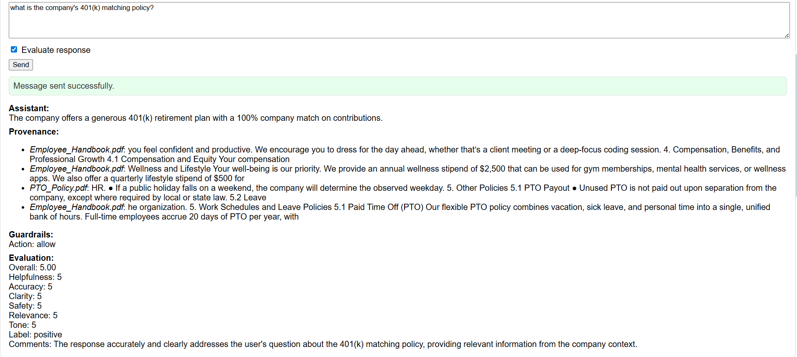

# Habeeb Prompt Optimization Toolkit for HR Assistants

A practical prototype showing how I built an internal HR knowledge assistant with:
- Optimized prompt management with versioning and activation
- Guardrails (PII/profanity heuristics + optional OpenAI Moderation)
- Automated response evaluation (LLM judge + heuristics)
- Retrieval-Augmented Generation (RAG) with provenance
- Persistence, authentication (JWT), and admin UI

Read the full story: [docs/blog.md](PromptOpt/docs/blog.md)

The goal: I wanted to demonstrate my real LLM Ops capabilities including prompt lifecycle, safety, evaluation, retrieval in a clean, runnable stack.

---

## Screenshots

- Login
  - 
- Chat Demo with evaluation & guardrails
  - 
- Prompt Manager (versions / activation)
  - 
- Admin Logs
  - 


---

## Quick scripts
Use these helpers to launch and test quickly.

Windows (PowerShell):
```powershell
# Start backend with migrations + seed if needed and frontend in new windows
cd scripts
./dev.ps1 -OpenAIKey "YOUR_OPENAI_KEY"

# Smoke test the API (health, login, me, prompts, chat)
./smoke.ps1 -Base "http://127.0.0.1:8000" -User admin -Pass admin
```

macOS/Linux:
```bash
# Start backend and frontend
./scripts/dev.sh "$OPENAI_API_KEY"

# Smoke test the API
./scripts/smoke.sh http://127.0.0.1:8000 admin admin
```

---

## What’s in the box
- `backend/` (FastAPI)
  - Auth (JWT), roles (admin/employee)
  - Chat API with evaluation, guardrails, and RAG + provenance
  - Prompt CRUD with versioning and activation
  - Role-based default prompt IDs (env-driven)
  - DB via SQLAlchemy (SQLite dev), Alembic migrations
  - Optional moderation (OpenAI Moderation API)
  - Seed script for example users and prompts
- `frontend/` (React + webpack-dev-server)
  - Login, chat demo (toggle evaluation), role badge
  - Admin: Prompt Manager (create, version, activate, rename, delete) + Admin Logs

---

## Requirements
- Node.js 18+
- Python 3.10+
- An OpenAI API key

Optional (recommended):
- GitHub CLI installed
- Postgres for production use (prototype uses SQLite)

---

## Environment variables
Create `backend/.env` (or export vars in your shell). Example values:

```
OPENAI_API_KEY=sk-...
JWT_SECRET_KEY=change-this-in-prod
DATABASE_URL=sqlite:///./app.db
JUDGE_MODEL=gpt-4o-mini

# Moderation (optional)
ENABLE_MODERATION=false
MODERATION_MODE=block   # or redact
MODERATION_MODEL=omni-moderation-latest

# Role-based default prompts (optional)
DEFAULT_PROMPT_ADMIN_ID=1
DEFAULT_PROMPT_EMPLOYEE_ID=2

# Embeddings (RAG)
EMBEDDING_MODEL=text-embedding-3-small
```

There is also `backend/env.example` you can copy:
```
cp backend/env.example backend/.env
```

---

## Install & run (dev)
Open two terminals: one for backend, one for frontend.

### 1) Backend
```bash
cd backend
python -m venv .venv
.\.venv\Scripts\Activate.ps1   # PowerShell (Windows)
# source .venv/bin/activate     # macOS/Linux
pip install -r requirements.txt

# Apply database schema
alembic upgrade head

# Seed example users/prompts (admin/admin, employee/employee)
python -m app.utils.seed

# Run API
python -m uvicorn app.main:app --reload --host 127.0.0.1 --port 8000
```
Check health: http://127.0.0.1:8000/health

### 2) Frontend
```bash
cd frontend
npm install
npm start
```
Open http://localhost:8080

---

## RAG: company document ingestion
- Admin-only API to ingest PDFs to a local FAISS index.
- Index files: `backend/data/company.faiss` and `company_meta.jsonl`.

How to ingest via API docs:
1) Login to get a token → http://127.0.0.1:8000/docs → Authorize with `Bearer <token>`
2) POST `/rag/ingest` with a PDF file → returns `{ ok: true, chunks: N }`
3) GET `/rag/status` to confirm `has_index` true and documents > 0

How chat uses RAG:
- If RAG index has documents, backend automatically retrieves top matches and appends them to the system prompt before calling the LLM.
- The `provenance` array in the response shows short text snippets and sources used.

---

## How to demo
1) Login
   - Use `admin/admin` (seeded). Role badge shows “Admin”.
2) Chat Demo
   - Ask an HR question with “Evaluate response” checked.
   - You’ll see: assistant answer, provenance (if RAG docs exist), guardrails, evaluation.
3) Prompt Manager (Admin)
   - Create a prompt (title + content).
   - Select it → type new content → “Save as new version”.
   - “Activate” a version. Try Chat again.
   - Rename title or delete prompt when testing is done.
4) Admin Logs
   - View recent conversations (server enforces admin-only).

---

## Architecture overview
- Frontend → FastAPI `/chat` → LLM (OpenAI) → response
- RAG
  - FAISS + OpenAI embeddings on ingested PDFs
  - Auto-used when index has documents; returns provenance items
- Guardrails
  - Heuristic checks: email/PII/profanity/injection → action: allow/warn/redact
  - Moderation (optional): OpenAI Moderation checks user input (block/redact)
- Evaluation
  - LLM judge (default `gpt-4o-mini`) returns scores (helpfulness, accuracy, …)
  - Heuristic fallback if judge call fails
- Persistence (SQLite dev)
  - Users, Prompts, PromptVersions, Conversations, Messages, Evaluations, Guardrails
- Auth
  - Login → JWT → role-based endpoints; UI gates on `/me`
- Role-based default prompt
  - If no `prompt_id` is provided in `/chat`, backend will use `DEFAULT_PROMPT_ADMIN_ID` or `DEFAULT_PROMPT_EMPLOYEE_ID` if set.

---

## Key endpoints
- Auth
  - `POST /login` → `{ access_token }`
  - `GET /me` → `{ id, username, role }`
- Chat
  - `POST /chat` `{ message, prompt_id?, evaluate? }` → response + provenance + guardrails + evaluation
  - `GET /chat/logs` (admin) → recent summaries
- Prompts (admin for mutations)
  - `GET /prompts` → list prompts
  - `GET /prompts/{id}/versions` → all versions
  - `POST /prompts` → create (v1 active)
  - `PUT /prompts/{id}` → save as new version (deactivates previous)
  - `POST /prompts/{id}/activate/{version}` → activate version
  - `PATCH /prompts/{id}/title` → rename prompt
  - `DELETE /prompts/{id}` → delete prompt and versions
- RAG
  - `POST /rag/ingest` (admin) → upload a PDF
  - `GET /rag/status` (admin) → index state

---

## Safety & evaluation
- Guardrails heuristic detects:
  - PII (emails, SSN/credit-card-like), profanity, prompt injection cues, sensitive topics
  - Actions: allow | warn | redact (and note)
- Moderation (optional): OpenAI Moderation checks incoming user text
  - `ENABLE_MODERATION=true`, choose `MODERATION_MODE=block|redact`
- Evaluation: LLM judge + fallback
  - Overall + criteria scores (helpfulness, accuracy, clarity, safety, relevance, tone)

---

## Tips & troubleshooting
- If `/chat` returns 401, sign in first and ensure the Authorization header is sent (frontend does this once logged in).
- If migrations drift, regenerate and apply:
  - `alembic revision --autogenerate -m "desc"`
  - `alembic upgrade head`
- To reset dev DB: stop backend, delete `backend/app.db`, re-run `alembic upgrade head` + `python -m app.utils.seed`.
- To rebuild RAG index: stop backend, delete files under `backend/data/`, re-ingest PDFs.

---


## License
MIT (for learning/demo purposes). Use it however you want but give credit. 
